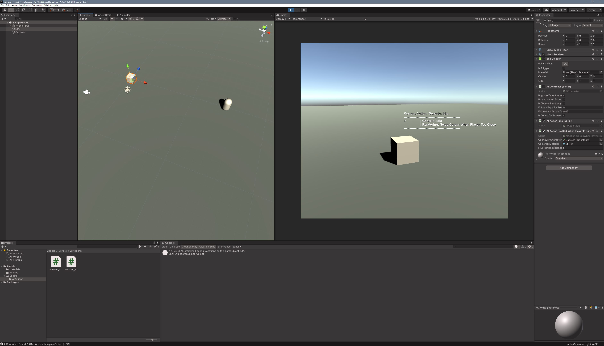

# Utility AI System for Unity

This is a skeleton implementation of a Utility AI system, for Unity 3D. 

The example project contains an AIController that will evaluate a set of AIAction components that are attached to the same gameObject. 

AIActions are built on top of an abstract base class, so all that's required for basic AI is to implement the scoring and update functions for each AIAction. 

A series of UnityActions are contained in the AIController for delegates to bind to. This is normally enough for higher level NPC code to check current state, spawn VFX, or play Audio, leaving the AIActions themselves as generic as possible. 

To keep code-size to a minimum, this implementation has very little error checking, but it does render simple debug information to the screen as an example of runtime debugging. 

Please note: Blackboards have not been implemented in this example project, so inter-AIAction comms will be limited. That is left as an exercise for the reader ;)

Please fork this repo, it is not actively maintained!

For more information about Utility AI:

* https://gdcvault.com/play/1021848/Building-a-Better-Centaur-AI
* http://www.gameaipro.com/GameAIPro/GameAIPro_Chapter09_An_Introduction_to_Utility_Theory.pdf
* https://gdcvault.com/play/1015683/Embracing-the-Dark-Art-of
* https://en.wikipedia.org/wiki/Utility_system